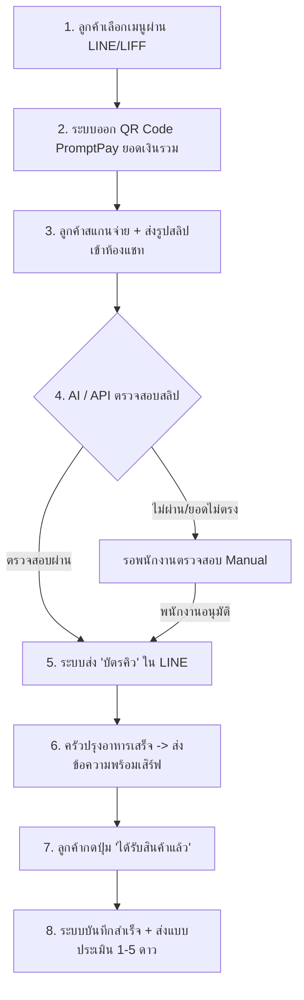

# 📖 คู่มือการฝึกอบรมระบบ ODM (Order Management System Training Guide)

คู่มือฉบับนี้จัดทำขึ้นเพื่อใช้ในการฝึกอบรมเจ้าหน้าที่และผู้ดูแลระบบในการใช้งานระบบสั่งอาหารและเครื่องดื่มผ่าน LINE Chatbot (ODM System) ซึ่งรองรับระบบหลายสาขา (Multi-branch), การตรวจสอบสลิปอัตโนมัติด้วย AI และระบบหลังบ้านสำหรับการจัดการคิวและตั้งค่าร้านค้า

---

## 📌 สารบัญ (Table of Contents)
1. [ภาพรวมของระบบและบทบาทผู้ใช้งาน (System Overview & User Roles)](#1-ภาพรวมของระบบและบทบาทผู้ใช้งาน-system-overview--user-roles)
2. [ขั้นตอนการทำงานสำหรับลูกค้า (Customer Flow)](#2-ขั้นตอนการทำงานสำหรับลูกค้า-customer-flow)
3. [ขั้นตอนการทำงานสำหรับพนักงานหน้าร้าน/ห้องครัว (Staff & Kitchen Flow)](#3-ขั้นตอนการทำงานสำหรับพนักงานหน้าร้านห้องครัว-staff--kitchen-flow)
4. [คู่มือการใช้งานสำหรับผู้จัดการสาขา (Manager & Admin Panel)](#4-คู่มือการใช้งานสำหรับผู้จัดการสาขา-manager--admin-panel)
5. [การแก้ไขปัญหาเบื้องต้นสำหรับเจ้าหน้าที่ (Troubleshooting Guide)](#5-การแก้ไขปัญหาเบื้องต้นสำหรับเจ้าหน้าที่-troubleshooting-guide)
6. [แนวทางปฏิบัติที่ดีที่สุด (Best Practices)](#6-แนวทางปฏิบัติที่ดีที่สุด-best-practices)

---

## 1. ภาพรวมของระบบและบทบาทผู้ใช้งาน (System Overview & User Roles)

ระบบ ODM ถูกออกแบบขึ้นเพื่อช่วยลดข้อผิดพลาด ลดขั้นตอนการทำงานของพนักงาน และสร้างประสบการณ์สั่งซื้ออาหารที่ไร้รอยต่อผ่านช่องทาง LINE ของลูกค้า

### 👥 บทบาทผู้ใช้งานหลัก (User Roles)
1. **ลูกค้า (Customer)**: ค้นหาเมนู สั่งอาหารผ่าน LINE (LIFF WebView), ชำระเงินด้วย QR Code, ติดตามคิว และประเมินความพึงพอใจ
2. **พนักงานหน้าร้าน / ครัว (Staff / Kitchen)**: รับออเดอร์ผ่านหน้าจอ **Queue Monitor**, จัดเตรียมอาหาร/เครื่องดื่ม, เปลี่ยนสถานะพร้อมเสิร์ฟ และตรวจสอบสลิปโอนเงินกรณีระบบสแกนอัตโนมัติไม่ผ่าน
3. **ผู้จัดการสาขา / แอดมิน (Manager / Admin)**: ตั้งค่าร้านค้า ( Busy Mode, เวลาเปิด-ปิด), จัดการเมนูและสต๊อกสินค้า, ดูรายงานประเมินความพึงพอใจ, และจัดการข้อมูลโต๊ะ/สาขา

---

## 2. ขั้นตอนการทำงานสำหรับลูกค้า (Customer Flow)

ระบบออกแบบมาเป็นลำดับ 6 ขั้นตอน เพื่อให้ลูกค้าทำรายการได้ง่ายที่สุดและมีการแจ้งเตือนอัปเดตตลอดเวลา

### 📝 รายละเอียดขั้นตอนของลูกค้า:
1. **เข้าชมเมนู**: ลูกค้ากดปุ่ม "ดูเมนู" หรือพิมพ์สั่งอาหารในห้องแชท LINE ระบบจะส่งข้อความรายการสินค้าพร้อมลิงก์เปิดหน้าสั่งซื้อ (LIFF WebView) เพื่อให้เลือกตัวเลือกพิเศษ (เช่น หวานน้อย, เพิ่มช็อต, ใส่กล่อง) ได้สะดวก
   
   
   *(ภาพตัวอย่าง: หน้าจอเลือกร้านค้าและสั่งอาหารผ่าน WebView/LIFF)*

2. **ชำระเงิน**: เมื่อกดสั่งซื้อ ระบบจะสร้างรูปภาพ **Dynamic PromptPay QR Code** ตามยอดเงินของออเดอร์นั้นโดยอัตโนมัติ
   
   
   *(ภาพตัวอย่าง: QR Code ชำระเงินที่ระบบสร้างขึ้น)*

3. **ส่งหลักฐาน**: ลูกค้าทำการบันทึกสลิปโอนเงินและส่งเข้าแชท LINE ของร้านค้า
4. **รับบัตรคิว**: ระบบทำการประมวลผลสลิปด้วย AI หากตรวจพบยอดเงินและบัญชีถูกต้อง ระบบจะอัปเดตสถานะเป็น `PAID` และส่ง **บัตรคิว (Queue Ticket)** แจ้งเวลารอโดยประมาณทันที
5. **รับสินค้า**: เมื่ออาหารพร้อมเสิร์ฟ ลูกค้าจะได้รับการแจ้งเตือนพร้อม **ปุ่มสีเขียว "ได้รับสินค้าแล้ว"** บน LINE
6. **ประเมินบริการ**: ลูกค้ากดยืนยันการรับอาหาร และกดให้คะแนนความพึงพอใจ 1-5 ดาว พร้อมพิมพ์ข้อเสนอแนะเพิ่มเติมได้

---

## 3. ขั้นตอนการทำงานสำหรับพนักงานหน้าร้าน/ห้องครัว (Staff & Kitchen Flow)

พนักงานเป็นกลไกสำคัญในการขับเคลื่อนคิวอาหาร โดยจะควบคุมผ่านระบบหลังบ้าน (Admin Dashboard)

### 3.1 หน้าจอติดตามสถานะคิว (Queue Monitor)
ให้พนักงานเปิดหน้าจอ **Queue Monitor** (`/admin/queue` หรือในระบบ `mamsoi8.online`) ทิ้งไว้บนหน้าจอแท็บเล็ตหรือคอมพิวเตอร์ในครัว เพื่อดูออเดอร์ที่สั่งเข้ามาแบบ Real-time

*(ภาพตัวอย่าง: หน้าจอคุมคิวออเดอร์ในส่วนของห้องครัว)*

> [!IMPORTANT]
> **สถานะออเดอร์และการเปลี่ยนสถานะในระบบ:**
> - **PENDING** (รอชำระเงิน): ลูกค้ากำลังเลือกสินค้าหรือยังไม่ได้ส่งหลักฐานโอนเงิน
> - **PAID** (ยืนยันรับออเดอร์): ลูกค้าชำระเงินเรียบร้อยแล้ว (คิวเข้าครัวเพื่อดำเนินการปรุง)
> - **PROCESSING** (กำลังจัดเตรียม): ครัวกำลังปรุงอาหาร (กดเปลี่ยนสถานะนี้เมื่อเริ่มทำเพื่อบอกลูกค้า)
> - **SHIPPED** (ปรุงเสร็จ/พร้อมเสิร์ฟ): อาหารปรุงเสร็จเรียบร้อยแล้วและวางอยู่ที่หน้าเคาน์เตอร์ **(ขั้นตอนนี้ระบบจะยิงแจ้งเตือนเข้า LINE ลูกค้าทันที)**
> - **COMPLETED** (ลูกค้ารับแล้ว): ลูกค้ารับของและกดยืนยันการรับบนโทรศัพท์ของตนเอง

### 3.2 การยืนยันสลิปแบบ Manual (เมื่อ AI สแกนไม่ผ่าน)
บางกรณีลูกค้าอาจส่งสลิปที่มีปัญหา (เช่น สลิปเบลอ, ยอดเงินโอนไม่ตรงกับระบบเนื่องจากลืมรวมค่าส่ง, หรือใช้บัญชีอื่นโอน) ระบบจะยังไม่ออกบัตรคิวให้
* **ขั้นตอนปฏิบัติ**:
  1. เข้าไปที่เมนู **Orders (รายการคำสั่งซื้อ)** ในระบบแอดมิน
  2. ค้นหาออเดอร์ที่มีสถานะ `PENDING` หรือที่มีการแนบสลิปมาแต่ระบบยังไม่ปรับสถานะ
  3. คลิกดูรายละเอียดออเดอร์ เพื่อตรวจสอบรูปภาพสลิปที่ลูกค้าอัปโหลดเข้ามาเปรียบเทียบกับยอดสั่งซื้อจริง
  4. หากยอดเงินและหลักฐานถูกต้อง ให้พนักงานคลิกปุ่ม **"อนุมัติออเดอร์ (Confirm Payment)"** ด้วยตนเอง เพื่อเปลี่ยนสถานะออเดอร์เป็น `PAID` และออกบัตรคิวให้ลูกค้า

  
  *(ภาพตัวอย่าง: หน้าจอรายละเอียดออเดอร์และการกดยืนยันสลิปแบบ Manual)*

---

## 4. คู่มือการใช้งานสำหรับผู้จัดการสาขา (Manager & Admin Panel)

แอดมินหรือผู้จัดการสาขาสามารถปรับแต่งระบบให้สอดคล้องกับสถานการณ์การขายจริงได้ผ่านเมนูบริหารจัดการ

### 4.1 การตั้งค่าร้านยุ่ง (Busy Mode)
หากหน้าร้านมีลูกค้าหนาแน่น หรือวัตถุดิบหมดชั่วคราว ผู้จัดการสามารถเปิด "โหมดร้านยุ่ง" เพื่อหยุดรับออเดอร์จาก LINE ชั่วคราวได้
1. ไปที่เมนู **Shop Config (ตั้งค่าร้านค้า)**
2. ติ๊กเลือกเปิดใช้งาน **Busy Mode (โหมดร้านยุ่ง)**
3. ป้อนข้อความแจ้งเตือนลูกค้า (เช่น *"ขออภัย ขณะนี้ออเดอร์หน้าร้านหนาแน่น ขอปิดรับออเดอร์ออนไลน์ชั่วคราว 30 นาที"* )
4. กดบันทึก ระบบจะบล็อกไม่ให้ลูกค้ากดสั่งสินค้าผ่านแชทและแสดงข้อความดังกล่าวแทน

*(ภาพตัวอย่าง: หน้าจอการเปิดโหมดร้านยุ่งและข้อความแจ้งเตือน)*

### 4.2 การจัดการเมนูและสต๊อกสินค้า (Product & Category Management)
* **การเปิด-ปิด เมนูอาหาร**: หากเมนูใดเมนูหนึ่งหมดระหว่างวัน ให้เข้าเมนู **Products (สินค้า)** ค้นหาเมนูนั้น แล้วคลิกปิดการใช้งาน (`isActive = false`) เมนูนั้นจะหายไปจากหน้าสั่งซื้อของลูกค้าทันที
* **การระบุราคาและตัวเลือกพิเศษ (Variants)**: สามารถกำหนดราคาสินค้าหลัก และสร้างกลุ่มตัวเลือก (เช่น ขนาดแก้ว, ร้อน/เย็น/ปั่น) พร้อมบวกราคาเพิ่มในเมนูนั้นได้

### 4.3 การตรวจสอบคะแนนการประเมิน (Customer Evaluations)
ความเห็นของลูกค้าจะช่วยปรับปรุงบริการ ผู้จัดการสามารถดูรายงานย้อนหลังได้ที่เมนู **Evaluations (แบบประเมิน)**
* หน้านี้จะรวบรวมคะแนนเฉลี่ย (🌟 1-5 ดาว) ของแต่ละออเดอร์พร้อมความคิดเห็นติชม
* สามารถจัดกลุ่มแยกตามช่วงเวลาเพื่อวิเคราะห์ประสิทธิภาพการให้บริการของพนักงานในแต่ละวันได้

*(ภาพตัวอย่าง: รายงานรีวิวและคะแนนความพึงพอใจ)*

---

## 5. การแก้ไขปัญหาเบื้องต้นสำหรับเจ้าหน้าที่ (Troubleshooting Guide)

| ปัญหาที่พบ | สาเหตุที่เป็นไปได้ | แนวทางการแก้ไขสำหรับพนักงาน |
|---|---|---|
| **1. ลูกค้าส่งสลิปแล้ว ระบบเงียบ ไม่ตอบรับ/ไม่ออกบัตรคิว** | - ยอดโอนไม่ตรงกับยอดสั่งซื้อ - ชื่อบัญชีผู้รับโอนไม่ตรงตามที่ระบบกำหนดไว้ - ภาพสลิปเบลอ หรือมีสิ่งบดบังข้อความสำคัญ | 1. ให้พนักงานเข้าไปตรวจสอบรายการสั่งซื้อในระบบหลังบ้าน เมนู **Orders** 2. หากสลิปถูกต้องแต่ยอดโอนมีเศษสตางค์ขาดไปเล็กน้อย ให้กด **"Confirm Payment"** เพื่อส่งบัตรคิวแบบ Manual ให้ลูกค้า 3. แจ้งลูกค้าหากต้องการให้ทำการแก้ไขออเดอร์ถัดไป |
| **2. หน้าสั่งซื้อ (WebView) ของลูกค้าขึ้นหน้าจอว่างเปล่า (Blank Page)** | - ตัวแปร URL ของแชทบอท (`CHATBOT_URL`) ในการตั้งค่าของเซิร์ฟเวอร์ชี้ไปโดเมนผิด | 1. ติดต่อเจ้าหน้าที่เทคนิคเพื่อตรวจสอบไฟล์ `.env` บนเซิร์ฟเวอร์ 2. ตรวจสอบว่าโดเมนหลักและโดเมนแชทบอทเปิดใช้งาน HTTPS (SSL) เรียบร้อยดี |
| **3. ครัวกด "พร้อมเสิร์ฟ" แล้ว แต่ไม่มีการแจ้งเตือนส่งไปที่ LINE ลูกค้า** | - LINE Channel Access Token ประจำสาขาหมดอายุ หรือตั้งค่าไม่ถูกต้องในหน้าสาขา | 1. ตรวจสอบการตั้งค่าในเมนู **Branches (จัดการสาขา)** ในระบบแอดมิน 2. ตรวจสอบว่าคีย์ Access Token ของสาขานั้นมีค่าตรงกับที่จดทะเบียนไว้ใน LINE Developers Console |
| **4. ร้านค้าแก้ไขรายละเอียดสินค้าแล้ว แต่ไม่แสดงผลบนหน้าจอสั่งซื้อของลูกค้า** | - แคช (Cache) ของบราวเซอร์ของลูกค้ายังคงจำค่าเดิมอยู่ | 1. แนะนำให้ลูกค้าปิดหน้าต่างสั่งซื้อ (LIFF WebView) แล้วกดเปิดใหม่อีกครั้ง 2. หรือพนักงานกด Clear Cache ในหลังบ้าน (ถ้ามีฟังก์ชัน) |

---

## 6. แนวทางปฏิบัติที่ดีที่สุด (Best Practices)

1. **ไม่ข้ามขั้นตอนสถานะ**: เมื่ออาหารเสร็จ ต้องเปลี่ยนสถานะเป็น **Ready / ปรุงเสร็จ (SHIPPED)** เสมอ ห้ามกดข้ามไปเป็น Completed ทันที เนื่องจากลูกค้าจะไม่ได้รับปุ่มกดยืนยันรับอาหาร และจะไม่สามารถทำแบบประเมินความพึงพอใจได้
2. **ตรวจสอบรูปภาพสลิปที่น่าสงสัย**: แม้ระบบ AI จะยืนยันสลิปให้อัตโนมัติ แต่พนักงานควรสุ่มตรวจสอบสลิปในหน้าหลังบ้านเป็นระยะเพื่อป้องกันการหลอกลวงด้วยภาพตัดต่อที่มีข้อมูลรหัสธุรกรรมเสมือนจริง
3. **อัปเดตสถานะ "โหมดร้านยุ่ง" ทันที**: หากระบบทำงานหนักจนไม่สามารถทำออเดอร์ได้ทัน ให้ปิดรับออเดอร์ทันทีเพื่อป้องกันลูกค้าต่อว่าเรื่องการจัดส่งอาหารล่าช้า
4. **ดูแลข้อมูลบัญชีรับเงินให้เป็นปัจจุบัน**: หากมีการเปลี่ยนเบอร์พร้อมเพย์หรือเลขบัญชีธนาคาร ให้รีบประสานงานผู้จัดการสาขาอัปเดตที่เมนู **Payment Config** หรือ **Bank Settings** ทันที เพื่อป้องกันไม่ให้ QR Code ที่ลูกค้าสแกนจ่ายเงินโอนไปผิดบัญชี

---
*จัดทำและปรับปรุงล่าสุดเมื่อ: 21 สิงหาคม 2026*
